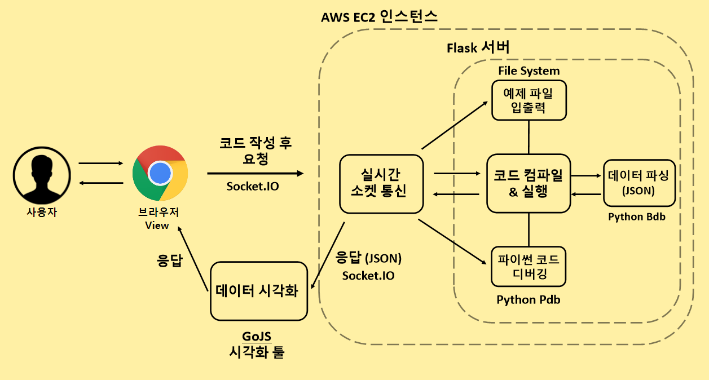

# Online Coding Tutor - OCT

## 코딩 교육 웹 플랫폼 서비스

#### 서비스 개요
준비된 다양한 예제를 실시간으로 코드 실행 단위 별로 시각화해주어 직관적으로 이해를 도와주는 웹 플랫폼입니다.

#### 누구를 위한 서비스?
1. 코딩을 처음 접하는 사용자
2. 나의 코드가 어떻게 순차적으로 실행되는지 궁금해하는 사용자
3. Python 개발 환경을 따로 설치할 필요없이 웹 브라우저에서 코드를 실행 시키고 싶은 사용자

## 서비스 구성

## 구현 사항

#### 서버 ( Backend )
1. Python과 Flask 구축한 백 엔드 서버는 WebSocket으로 통신하도록 Socket.IO를 이용하여 웹 브라우저와 실시간으로 데이터를 주고받을 수 있도록 구현
2. Python Bdb 디버깅 툴을 이용하여 변수타입, 변수명, 함수 등등을 가져와 데이터 파싱
3. Docker 가상환경을 이용하여 코드를 실행 - SandBoxing 구현
4. AWS EC2 인스턴스에 서버를 배포
5. AWS ELB (로드밸런서) + AWS ROUTE 53을 사용하여 Scale-UP 효과와 DNS 관리 기능 구현

#### 클라이언트 ( Client )
1. GoJS 라이브러리와 서버에서 파싱한 데이터를 받아 코드 시각화 구현
2. CodeMirror 라이브러리를 사용하여 클라이언트에서 코드 작성, 수정 및 코드 제출 가능
3. 사용자에게 여러 기능들을 이용할 수 있도록 View 구현

## 주요 기능
1. Python 기반으로 작성되어 코드 실행 단위별 시각화 기능
2. 사용자가 코드를 직접 작성 후 실행시켜 실시간 시각화할 수 있는 기능을 제공
3. 코드를 컴파일해 실행 결과를 보여주는 기능
4. Pdb 디버깅 툴을 이용한 디버깅 기능 제공
5. 개발환경 설정 필요 없이 웹 브라우저에서 코드를 실행시킬 수 있는 플랫폼을 제공

## 세부 기능
1. 노드 클릭시 pointing하는 노드 하이라이트 기능
2. 마우스 클릭 후 드래그해서 Diagram 이동 가능

## 주의 사항
<!-- ### 코드 시각화 -->
* class, range, closur, decorator(@), unpack(*) - 지원하지 않습니다
* 단계가 250 넘어가면 실행되지 않습니다 -> 250단계까지만 실행
* global string 길이 제한
* object string 길이 제한

#### TabError: inconsistent use of tabs and spaces in indentation
* 해당 에러는 들여쓰기 에러에 해당됩니다.
* python style guid(pep8)에서는 들여쓰기 = 4 spaces 로 규정해놓았으니 이를 참고해주세요.

<!-- ## 추후 업데이트 사항
* pdb 커맨드 레퍼런스 제공 예정
* 툴팁으로 정보 제공 예정 -->
