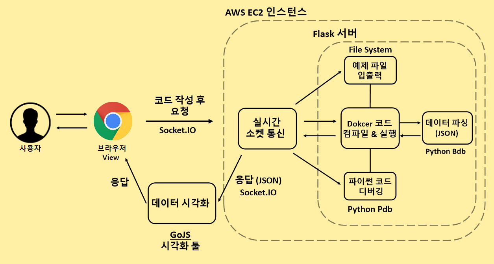
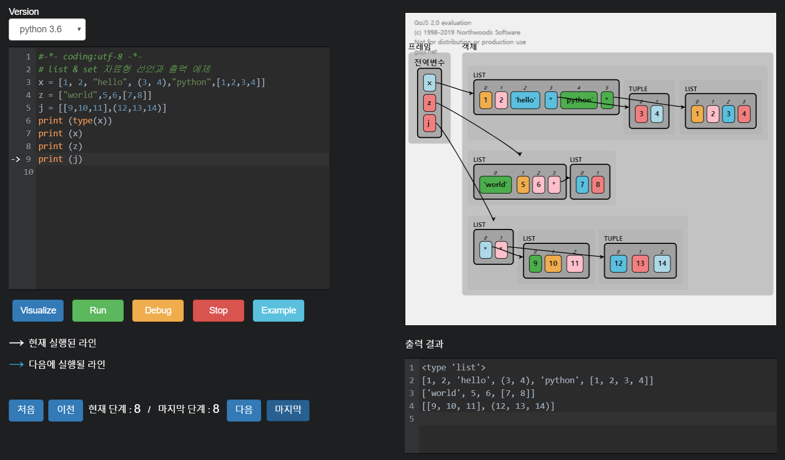

# Online Coding Tutor - OCT

## 코딩 교육 웹 플랫폼 서비스

### 서비스 개요
준비된 다양한 예제를 실시간으로 코드 실행 단위 별로 시각화해주어 직관적으로 이해를 도와주는 웹 플랫폼입니다.

### 누구를 위한 서비스 ?
1. 코딩을 처음 접하는 사용자
2. 나의 코드가 어떻게 순차적으로 실행되는지 궁금해하는 사용자
3. Python 개발 환경을 따로 설치할 필요없이 웹 브라우저에서 코드를 실행 시키고 싶은 사용자

## 서비스 구성도

## 실행 화면

## 구현 사항

### 서버 ( Backend )
1. Python과 Flask 구축한 백 엔드 서버는 WebSocket으로 통신하도록 Socket.IO를 이용하여 웹 브라우저와 실시간으로 데이터를 주고받을 수 있도록 구현
2. Python Bdb 디버깅 툴을 이용하여 변수타입, 변수명, 함수 등등을 가져와 데이터 파싱
3. Docker 가상환경을 이용하여 코드를 실행 - SandBoxing 구현
4. AWS EC2 인스턴스에 서버를 배포
5. AWS ELB (로드밸런서) + AWS ROUTE 53을 사용하여 Scale-Out 효과와 DNS 관리 기능 구현

### 클라이언트 ( Client )
1. 서버에서 파싱한 데이터를 받아 GoJS 라이브러리를 사용하여 코드 시각화 구현
2. CodeMirror 라이브러리를 사용하여 클라이언트에서 코드 작성, 수정 및 코드 제출 가능
3. 사용자에게 여러 기능들을 이용할 수 있도록 View 구현

## 주요 기능
1. Python 기반으로 작성되어 코드 실행 단위별 시각화 기능
2. 사용자가 코드를 직접 작성 후 실행시켜 실시간 시각화할 수 있는 기능을 제공
3. 코드를 컴파일해 실행 결과를 보여주는 기능
4. Pdb 디버깅 툴을 이용한 디버깅 기능 제공
5. 개발환경 설정 필요 없이 웹 브라우저에서 코드를 실행시킬 수 있는 플랫폼을 제공

## Reference

### Visualize
1. Python 2.7 버전 기반으로 코드 시각화
2. 노드 클릭시 해당 노드가 Pointing 하는 모든 노드들을 하이라이트 해주는 기능
  > 노드가 어떤 노드들을 가르키는지 확인 가능
3. 마우스 클릭 후 드래그해서 Diagram 이동 가능
4. 진행 상황의 처음, 이전, 다음, 마지막 단계를 볼 수 있는 기능 제공

### Run
- Python2.7, Python3.6 버전 지원
- Docker 가상 환경에서 코드 컴파일 & 실행 (SandBoxing)
- 모듈 Import 기능 제공 (Python2,3 기본 모듈 - re, random, math 등등 )
- 원하는 코드를 실행해 결과 확인 가능

### Debug
- Python2.7, Python3.6 버전 지원
- 모듈 Import 기능 제한 (os, sys, subprocess, ...)
- Pdb 디버깅 툴을 이용한 디버깅 가능 (명령어 입력 방식)
  > Pdb reference  
  > 2.7 버전 : https://docs.python.org/ko/2.7/library/pdb.html  
  3.6 버전 : https://docs.python.org/ko/3.6/library/pdb.html

### AWS EC2 - Ubuntu 서버 정보
- Version : Ubuntu 18.04.3 LTS
- CPU Model : Intel(R) Xeon(R) CPU E5-2676 v3 @ 2.40GHz
- Memory : 1GB

### Docker Container 정보
- Python2.7, Python3.6 빌드
- CPU Limit - CPU 자원 제한 크기 (Default : CPU 1개 할당)
- Memory Limit - 메모리 제한 크기 (Default : 64메가)
- IO Access Limit : READ_ONLY (읽기만 가능)

## 제약 사항

### Visualize
* class, range, closur, decorator(@), unpack(*)
  > 지원하지 않습니다
* 코드 단계는 250 단계 제한
  > 250 단계를 넘어서는 코드는 실행 제한
* global string 길이 제한
* object string 길이 제한

### 공통
#### TabError: inconsistent use of tabs and spaces in indentation
- 해당 에러는 들여쓰기 에러에 해당됩니다.
- python style guid(pep8)에서는 들여쓰기 = 4 spaces 로 규정해놓았으니 이를 참고해주세요.

## 문의 사항
Email : wwlee9410@gmail.com 으로 연락주세요.

<!-- ## 추후 업데이트 사항
* pdb 커맨드 레퍼런스 제공 예정
* 툴팁으로 정보 제공 예정 -->
